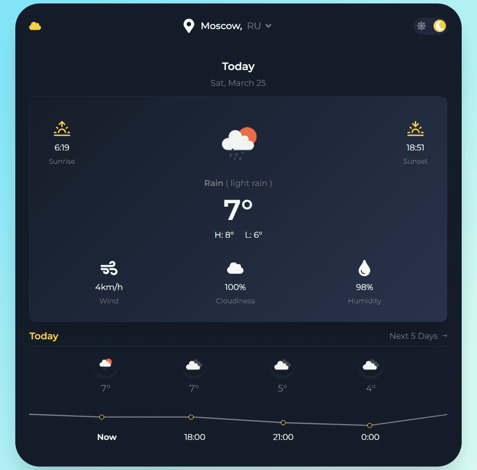

<h1 style="text-align: center">Weather App</h1>

---

## Описание проекта

Приложение, в котором можно узнать погоду в любом городе на данный момент и на 5 следующих дней.

## Используемые технологии

    

## Функциональность

* 2 страницы - первая отображает погодн на данный момент и следующие 12 часов. Вторая - отображает погоду на следующие 5 дней.
* при вводе текста в поиск выпадает список подходящих городов (происходит запрос на Open Api - `http://api.openweathermap.org/geo/1.0/direct`, частота запросов при введении оптимизирована с помощью хука useDebounce)
* после выбора города и нажатия кнопки поиск отправляется запрос на `https://api.openweathermap.org/data/2.5/forecast`
* отправка запросов происходит с помощью библиотеки `axios`
* при работе используется state - менеджер `Redux Toolkit`
* имеется возможность сменить тему приложения. По умолчанию стоит ночная тема.
* адаптивная вёрстка

## Установка

1. Клонировать репозиторий
`git clone https://github.com/koshinva/weather-app.git`

2. Установить зависимости
`npm install`

3. Запустить локально на своей машине с помощью команды
`npm run start`

4. Перейти в браузер по ссылке  `http://localhost:3000/` 

## Ссылки

**Демо** версия проекта доступна по **[ссылке](https://koshinva.github.io/weather-app/ 'https://koshinva.github.io/weather-app/')**

📫 Задать вопрос по проекту 

